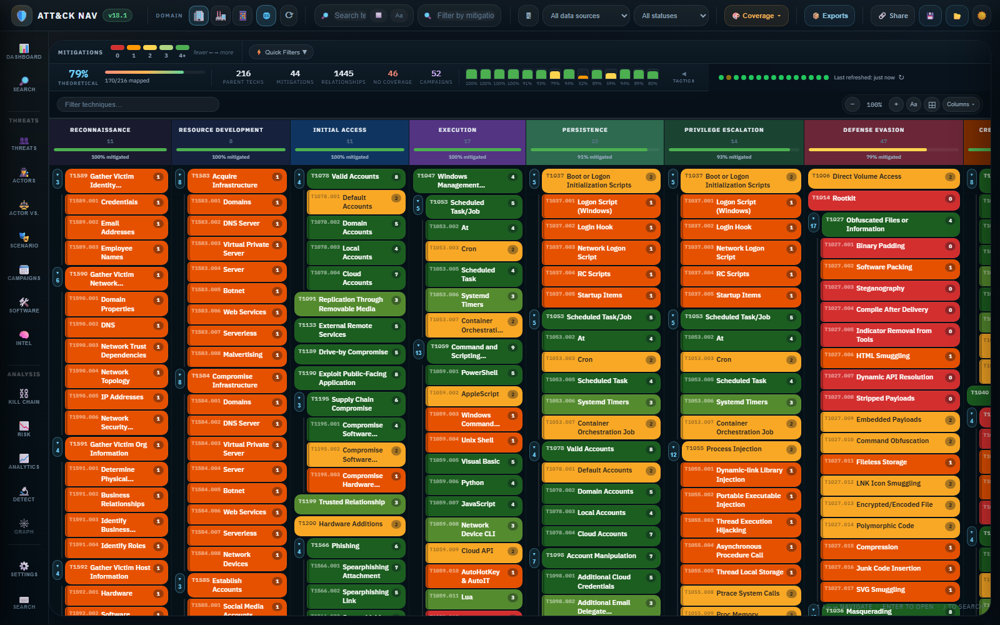
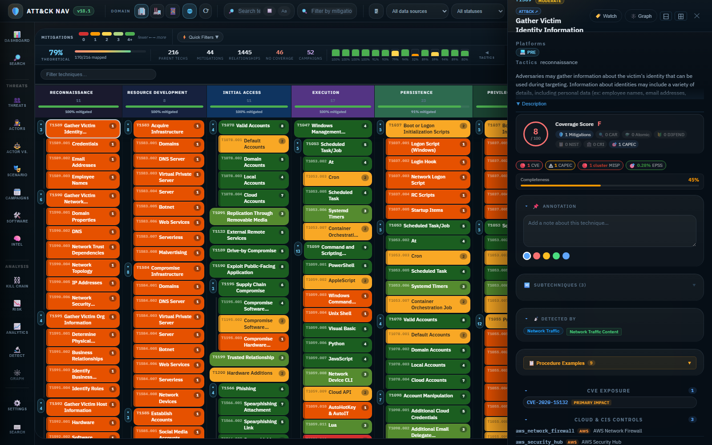
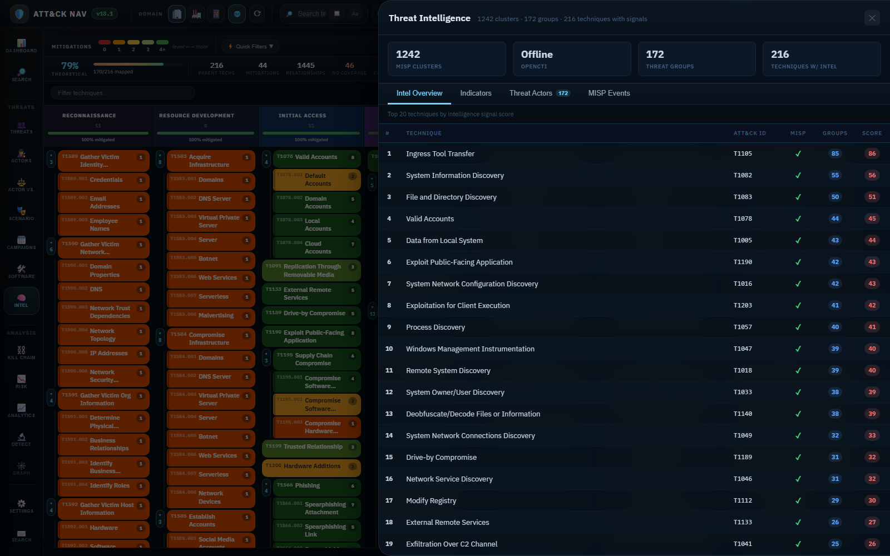

<div align="center">
  

  # ATTACK-Navi

  [](https://angular.dev)
  [](https://www.typescriptlang.org/)
  [](https://teamstarwolf.github.io/ATTACK-Navi/)
  [](.github/workflows)

  **[Live Site](https://teamstarwolf.github.io/ATTACK-Navi/)** | **[Docs](docs/README.md)** | **[Application Overview](docs/application-overview.md)** | **[Workflows](WORKFLOWS.md)** | **[Architecture](ARCHITECTURE.md)** | **[Security](SECURITY.md)**
</div>

ATTACK-Navi is a browser-based cybersecurity analysis workbench built around the MITRE ATT&CK framework. It combines ATT&CK navigation, threat-intelligence context, exposure mapping, detection coverage, and reporting in a single interactive matrix.

---

## What ATTACK-Navi Focuses On

1. navigating ATT&CK as an analyst workspace instead of a static matrix
2. correlating intelligence, exposure, compliance, and detection data at the technique level
3. turning live analysis state into shareable reports, exports, and review-ready artifacts

## Core Workflows

| Workflow | What it supports |
|----------|------------------|
| Coverage review | Assess mitigations, controls, data sources, and completeness by tactic or technique |
| Threat-intelligence correlation | Pivot from techniques into groups, campaigns, software, MISP events, and OpenCTI indicators |
| Exposure analysis | Review CVE, KEV, EPSS, ExploitDB, and Nuclei evidence against ATT&CK techniques |
| Detection validation | Inspect Sigma, Elastic, Splunk, Atomic Red Team, and CAR mappings in one place |
| Reporting and sharing | Export CSV, XLSX, HTML, PNG, JSON state, and Navigator layers, or share URL-based filter state |

---

## Live Demo

**[https://teamstarwolf.github.io/ATTACK-Navi/](https://teamstarwolf.github.io/ATTACK-Navi/)**

The app loads ATT&CK data directly from MITRE's GitHub repository. The core matrix still runs without a backend, but secure OpenCTI/MISP deployments can now use an optional backend proxy under `server/`.

---

## Screenshots

<table>
<tr>
<td width="50%"><strong>Technique Detail + Enrichment Sidebar</strong><br></td>
<td width="50%"><strong>Threat Intelligence Panel</strong><br></td>
</tr>
</table>

---

## Features

### Interactive ATT&CK Matrix
- Full Enterprise (201 techniques, 424 subtechniques), ICS, and Mobile domain support
- Click any technique to open a detailed sidebar with 25+ enrichment sections
- Expand/collapse subtechniques per tactic column
- Multi-select techniques for bulk operations
- Sort by risk score, dim uncovered techniques, gap view mode

### 24 Heatmap Visualization Modes

| Category | Modes |
|----------|-------|
| **Coverage** | Coverage, Status, Controls |
| **Risk** | Risk, Exposure, Frequency, Unified Risk, EPSS Probability |
| **Threat Intel** | Campaign, Software, KEV, Intelligence |
| **Detection** | Sigma Rules, Elastic Rules, Splunk Detections, CAR, Detection |
| **Defense** | D3FEND, Engage |
| **Compliance** | NIST 800-53, CRI Profile, VERIS Actions |
| **Vulnerability** | CVE |

### Threat Intelligence Platform (TIP)
- Unified panel combining MISP Galaxy, OpenCTI indicators, and ATT&CK threat groups
- Four tabs: Intel Overview, Indicators (IOCs), Threat Actors, MISP Events
- Per-technique intelligence scoring across all sources
- Live MISP server connection with attribute/event queries
- OpenCTI GraphQL integration for STIX/YARA/Sigma indicators

### Vulnerability & Exposure Analysis
- **2,000+ CVE-to-ATT&CK mappings** from CTID curated datasets
- **NVD bulk precomputation** — recent CVEs (120-day window) mapped via 708 CWE entries
- **CISA KEV catalog** with ransomware campaign indicators
- **EPSS scores** — exploitation probability from FIRST.org API
- **ExploitDB** — public exploit availability per technique
- **Nuclei templates** — automated scan template counts per technique

### Detection & Validation
- **Sigma** — live rule counts from SigmaHQ Navigator layer + rule generation/export
- **Elastic Detection Rules** — rule counts from elastic/detection-rules
- **Splunk Security Content** — detection counts from splunk/security_content
- **Atomic Red Team** — 167+ test procedures with live GitHub YAML fetching
- **CAR Analytics** — MITRE Cyber Analytics Repository mappings
- **Zeek/Suricata/YARA** — template generation per technique

### Compliance & Controls
- **NIST 800-53 Rev5** — control-to-technique mappings from CTID
- **CRI Profile v2.1** — Cybersecurity & Resilience Index controls
- **Cloud Controls** — AWS, Azure, GCP security control mappings
- **VERIS** — Verizon DBIR incident action framework
- **D3FEND** — MITRE defensive technique countermeasures
- **MITRE Engage** — adversary engagement activities

### Analysis & Reporting
- **Radar chart** — SVG coverage polygon across all 14 tactics
- **Kill chain analysis** — technique distribution across phases
- **Risk matrix** — impact vs. likelihood scoring
- **Technique graph** — relationship visualization
- **Campaign timeline** — temporal campaign analysis
- **Actor comparison** — side-by-side threat group analysis
- **Scenario simulation** — what-if coverage modeling
- **Coverage diff** — compare two states over time
- **Technique completeness score** — 0-100% from 13 data sources

### Export Formats
- CSV, XLSX (multi-sheet workbook), HTML report, PNG screenshot
- JSON state (save/restore), ATT&CK Navigator layer format
- Sigma rules, SIEM queries, YARA rules, Suricata rules
- STIX 2.1 bundles, MISP event templates

### User Experience
- 35+ navigable panels via icon rail
- Collapsible sidebar sections with smart expand (shows sections with data)
- Data source health ribbon — 15+ green/yellow/red status dots
- Dark/light theme toggle
- Mobile-responsive layout (bottom nav bar, full-width sidebar)
- URL hash state persistence — shareable links
- Keyboard shortcuts for power users

---

## Data Sources & Integrations

### Live Data (fetched at runtime)

| Source | Provider | Data |
|--------|----------|------|
| ATT&CK STIX | MITRE GitHub | Techniques, groups, software, campaigns, mitigations |
| Atomic Red Team | Red Canary GitHub | Test procedure counts + on-demand YAML |
| CVE Mappings | CTID GitHub | 839 curated + 1,183 KEV CVE-to-ATT&CK mappings |
| CISA KEV | CISA JSON feed | Known exploited vulnerabilities catalog |
| EPSS | FIRST.org API | Exploitation probability scores (batched) |
| NVD Bulk | NIST NVD 2.0 API | Recent CVEs mapped via CWE (120-day window) |
| Elastic Rules | Elastic GitHub | Detection rule counts per technique |
| Splunk Content | Splunk GitHub | Detection content counts per technique |
| ExploitDB | Offensive Security GitLab | Public exploit availability |
| Nuclei Templates | ProjectDiscovery GitHub | Scan template counts |
| NIST 800-53 | CTID GitHub | Control mappings (Rev5, Jan 2025) |
| Cloud Controls | CTID GitHub | AWS, Azure, GCP mappings |
| CRI Profile | CTID GitHub | CRI v2.1 control mappings |
| VERIS | CTID GitHub | Incident action framework |
| CAPEC | MITRE CTI GitHub | Attack pattern STIX bundle |
| MISP Galaxy | MISP GitHub | 1,242 ATT&CK cluster entries |
| Sigma Layer | SigmaHQ GitHub | Rule count Navigator layer |
| CWE Catalog | Bundled JSON | 708 weakness entries |

### User-Configurable

| Source | Protocol | Configuration |
|--------|----------|---------------|
| MISP Server | REST API | URL + API key + Org ID (Settings panel) |
| OpenCTI | GraphQL | URL + Bearer token (Settings panel) |
| NVD API Key | REST | Optional key for faster rate limits (Settings panel) |

### Bundled (static templates)

| Source | Content |
|--------|---------|
| D3FEND | ~100 defensive countermeasures |
| MITRE Engage | ~30 adversary engagement activities |
| CAR | ~30 detection analytics |
| Zeek | Network telemetry script templates |
| Suricata | IDS rule templates |
| YARA | Malware detection pattern templates |

---

## Getting Started

### Prerequisites
- Node.js 18+ and npm

### Install & Run

```bash
git clone https://github.com/TeamStarWolf/ATTACK-Navi.git
cd ATTACK-Navi
npm install
npx ng serve
```

Open [http://localhost:4200](http://localhost:4200).

### Production Build

```bash
npx ng build
```

Output: `dist/mitre-mitigation-navigator/browser/`

### Optional Secure Proxy For OpenCTI / MISP

If you want browser clients to stop holding OpenCTI or MISP secrets directly:

```bash
npm run proxy:install
copy server\\.env.example server\\.env
npm run proxy:start
```

Then set the Settings panel integration mode to `Secure backend proxy` and enter your proxy URL, for example `http://localhost:8787`.

### Deploy to GitHub Pages

The repository includes a GitHub Actions workflow (`.github/workflows/deploy.yml`) that automatically builds and deploys to GitHub Pages on every push to `main`.

---

## Architecture

The application follows a reactive state management pattern using Angular 19 standalone components with OnPush change detection.

```
AppComponent (shell)
  +-- ToolbarComponent (top bar, heatmap selector, search, filters)
  +-- NavRailComponent (35+ panel icons, responsive bottom bar on mobile)
  +-- MatrixComponent (ATT&CK grid, heatmap rendering, technique cells)
  +-- SidebarComponent (25+ enrichment sections per technique)
  +-- 30+ PanelComponents (overlay panels for each feature)
  +-- DataHealthComponent (service status ribbon)
```

### State Management

**FilterService** is the central state hub. All UI state flows through RxJS BehaviorSubjects:
- Selected technique, active panel, heatmap mode
- Filter selections (groups, campaigns, software, platforms, data sources)
- Search terms, implementation status filters
- Bidirectional URL hash synchronization

### Data Flow

```
DataService (loads ATT&CK STIX)
  --> Domain model (techniques, groups, mitigations, campaigns)
    --> MatrixComponent (combines domain + filter state --> rendered grid)
    --> SidebarComponent (hydrates technique details from 15+ services)
```

### Heatmap Pipeline (7 steps per mode)

Each of the 24 heatmap modes follows this pipeline:
1. `filter.service.ts` — HeatmapMode type union
2. `legend.component.ts` — color scale configuration
3. `toolbar.component.ts` — dropdown entry
4. `toolbar.component.html` — button label
5. `matrix.component.ts` — score map computation
6. `technique-cell.component.ts` — color method
7. `matrix.component.html` — input bindings (3 instances)

See [ARCHITECTURE.md](ARCHITECTURE.md) for the full walkthrough.

---

## Configuration

### MISP Server (optional)

1. Click **Settings** in the nav rail
2. Find the **MISP** section under Integrations
3. Enter your MISP server URL, API key, and organization ID
4. Click **Test & Save**

Once connected, the TIP panel's MISP Events tab shows live event data, and the sidebar displays MISP attributes for selected techniques.

### OpenCTI (optional)

1. Click **Settings** in the nav rail
2. Find the **OpenCTI** section under Integrations
3. Enter your OpenCTI URL and API token
4. Click **Test & Save**

Once connected, the sidebar shows OpenCTI indicators (STIX, YARA, Sigma patterns) and the TIP panel merges OpenCTI threat actors with ATT&CK groups.

### NVD API Key (optional)

Adding an NVD API key in Settings enables faster CVE queries (200ms vs 500ms rate limit).

---

## Keyboard Shortcuts

| Key | Action |
|-----|--------|
| `Escape` | Close sidebar / active panel |
| `/` | Focus search |
| `?` | Show keyboard help |

---

## Tech Stack

| Technology | Version | Purpose |
|------------|---------|---------|
| Angular | 19.2 | UI framework (standalone components, OnPush) |
| RxJS | 7.8 | Reactive state management |
| TypeScript | 5.7 | Type safety |
| SCSS | N/A | Component-scoped styling |
| xlsx | 0.18.5 | Excel workbook export |
| tinycolor2 | 1.6 | Color manipulation for heatmaps |

---

## Project Structure

```
src/
  app/
    components/          # 49 UI components
      matrix/            # Main ATT&CK grid renderer
      sidebar/           # Technique detail drawer (25+ sections)
      toolbar/           # Top bar with search, filters, heatmap selector
      nav-rail/          # Navigation icon rail (35+ panels)
      threat-intelligence-panel/  # Unified TIP (MISP + OpenCTI)
      cve-panel/         # CVE/exposure analysis
      detection-panel/   # Detection rule coverage
      analytics-panel/   # Radar chart + tactic breakdown
      ...                # 40+ additional panels
    services/            # 43 injectable services
      data.service.ts    # Core ATT&CK STIX loader
      filter.service.ts  # Central UI state (BehaviorSubjects)
      cve.service.ts     # NVD + CWE-to-ATT&CK (708 mappings)
      attack-cve.service.ts  # CTID CVE mappings (2,000+)
      misp.service.ts    # MISP Galaxy + live server
      opencti.service.ts # OpenCTI GraphQL integration
      elastic.service.ts # Elastic Detection Rules
      sigma.service.ts   # Sigma rule mapping + generation
      epss.service.ts    # EPSS exploitation scores
      ...                # 30+ additional services
    models/              # 11 TypeScript interfaces
    pipes/               # Custom template pipes
  assets/
    data/
      cwe-catalog.json   # 708-entry CWE catalog
  styles.scss            # Global styles + panel overlays
```

---

## Documentation

| Document | Description |
|----------|-------------|
| [docs/README.md](docs/README.md) | Documentation index and recommended reading order |
| [docs/application-overview.md](docs/application-overview.md) | Product-level overview of workflows, runtime model, strengths, and current limits |
| [ARCHITECTURE.md](ARCHITECTURE.md) | Component architecture, data flow, state management patterns |
| [WORKFLOWS.md](WORKFLOWS.md) | End-to-end analyst workflows: Behavior, Intel, Exposure, Detection, Validation, Defense |
| [DATA_SOURCE_SCORECARD.md](DATA_SOURCE_SCORECARD.md) | Integration status for each data source with priority recommendations |
| [docs/HEATMAPS.md](docs/HEATMAPS.md) | Heatmap modes, scoring intent, and implementation notes |
| [docs/COMPONENTS.md](docs/COMPONENTS.md) | Component-level notes for the Angular UI surface |
| [docs/SERVICES.md](docs/SERVICES.md) | Service responsibilities and data-loading helpers |
| [docs/CONFIGURATION.md](docs/CONFIGURATION.md) | Configuration flags, local settings, and integration setup details |
| [MAPPINGS_CHEAT_SHEET.md](MAPPINGS_CHEAT_SHEET.md) | Reference guide for ATT&CK, CVE, CWE, CAPEC, CPE, D3FEND mapping systems |
| [OPEN_SOURCE_INTEGRATIONS.md](OPEN_SOURCE_INTEGRATIONS.md) | Roadmap for open-source tool integrations |
| [CONTRIBUTING.md](CONTRIBUTING.md) | Development setup, Angular conventions, and extension patterns |
| [SECURITY.md](SECURITY.md) | Vulnerability reporting guidance and deployment/security posture |
| [CODE_OF_CONDUCT.md](CODE_OF_CONDUCT.md) | Community participation expectations |

---

## Community & Security

- Use the optional backend proxy under `server/` when you do not want browser clients handling OpenCTI or MISP credentials directly.
- Prefer GitHub Pages or another static host for the core UI, and move integration secrets to server-side infrastructure when needed.
- Review [SECURITY.md](SECURITY.md) before exposing a self-hosted deployment or enabling third-party integrations.
- Follow [CONTRIBUTING.md](CONTRIBUTING.md) and [CODE_OF_CONDUCT.md](CODE_OF_CONDUCT.md) when proposing changes or reporting issues.

---

## Project Status

ATTACK-Navi is already usable as a public analyst workbench and demo environment. The strongest current surfaces are matrix exploration, technique enrichment, threat-intelligence correlation, and export/reporting flows.

Current documentation work is focused on making the application easier to understand as a product: what it is best at today, where live integrations fit, and where mapped data remains partial or source-dependent.

---

## License

[MIT License](LICENSE) for the application code in this repository.

MITRE ATT&CK is a registered trademark of The MITRE Corporation. Third-party data sources, APIs, and upstream content remain subject to their own licenses and terms.
