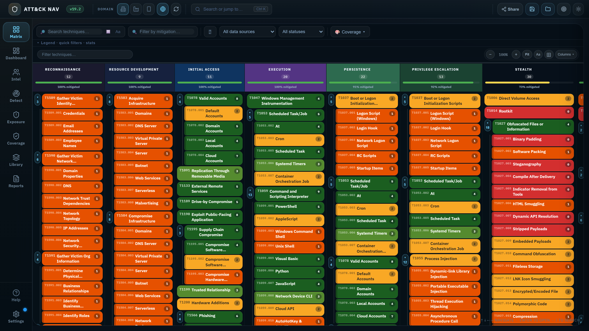
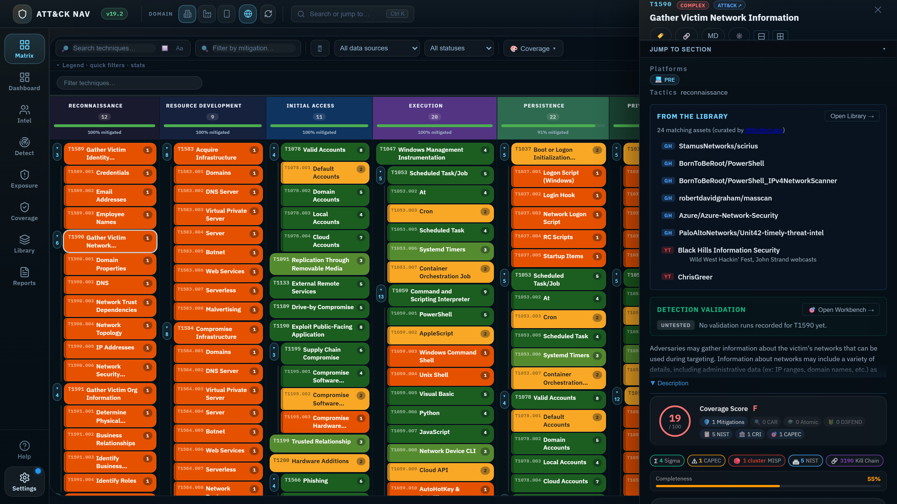
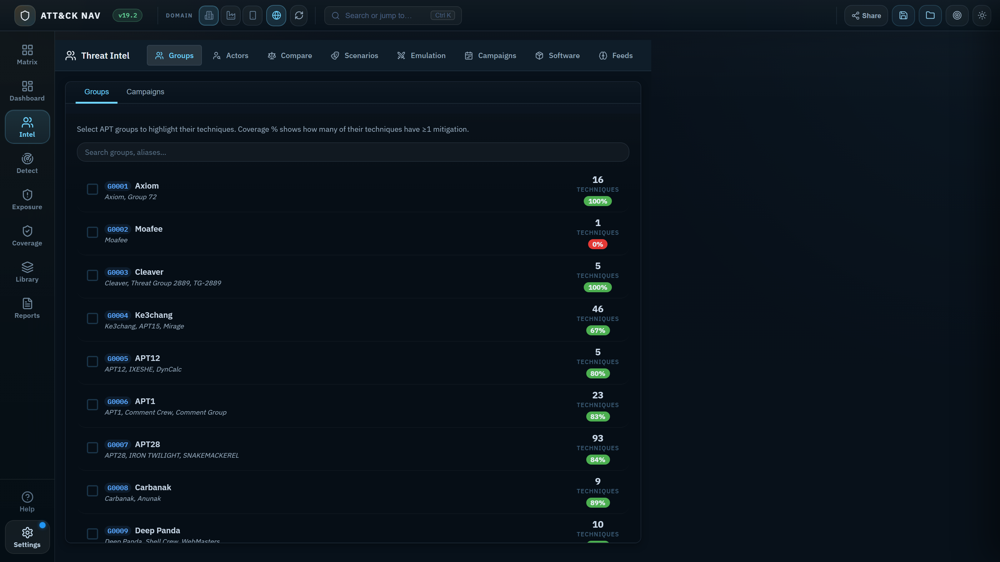

<div align="center">
  

  # ATTACK-Navi

  **A browser-based MITRE ATT&CK® analyst workbench — navigate the matrix, correlate threat intelligence, map exposure, measure detection coverage, and generate review-ready reports, all in one place.**

  [](https://angular.dev)
  [](https://www.typescriptlang.org/)
  [](https://teamstarwolf.github.io/ATTACK-Navi/)
  [](.github/workflows/deploy.yml)
  [](LICENSE)

  **[▶ Live Demo](https://teamstarwolf.github.io/ATTACK-Navi/)** &nbsp;·&nbsp; [Docs](docs/README.md) &nbsp;·&nbsp; [Architecture](ARCHITECTURE.md) &nbsp;·&nbsp; [Workflows](WORKFLOWS.md) &nbsp;·&nbsp; [Reference Library](#companion-reference-library) &nbsp;·&nbsp; [Changelog](CHANGELOG.md) &nbsp;·&nbsp; [Security](SECURITY.md)
</div>

---

## Overview

ATTACK-Navi turns the MITRE ATT&CK matrix into a working analyst environment rather than a static reference. A single interactive grid becomes the entry point to nine focused workspaces that layer real threat-intelligence, vulnerability, detection, and compliance data onto every technique — then let you turn that live analysis into shareable links, exports, and reports.

It runs entirely in the browser as a static single-page app with **no backend required**: ATT&CK data and every open-source mapping are fetched client-side from their authoritative sources at runtime. An optional proxy under `server/` exists only for keeping OpenCTI/MISP credentials off the client.

> **Why it's different:** every factual linkage is grounded. Mappings are either fetched live from authoritative repositories (MITRE, CTID, MISP, SigmaHQ, …), computed from real ATT&CK STIX relationships, or clearly labeled `curated` where they are editorial. See [Data Integrity](#data-integrity).

### At a glance

| | |
|---|---|
| **Domains** | Enterprise (835 techniques + subtechniques), ICS, and Mobile |
| **Workspaces** | 9 routed, lazy-loaded areas with bookmarkable URLs |
| **Heatmap modes** | 31, grouped into Coverage, Threat Landscape, Vulnerabilities, Detections, and Frameworks |
| **Sidebar enrichment** | 48 sections per technique, from CVEs to detection rules to threat actors |
| **Data sources** | 30+ live integrations plus user-configurable MISP / OpenCTI |
| **Command palette** | `Ctrl+K` — search entities or jump to any of 46 destinations by name |
| **Backend** | None required (static SPA); optional secrets proxy under `server/` |

---

## Live Demo

**➡ [https://teamstarwolf.github.io/ATTACK-Navi/](https://teamstarwolf.github.io/ATTACK-Navi/)**

The app loads ATT&CK data directly from MITRE's GitHub repository — no sign-up, no server. Try `Ctrl+K` to jump anywhere, click any matrix cell to open the enrichment sidebar, and press `?` for the full shortcut list.

---

## Workspaces

Everything lives in nine workspaces on the left rail. Each has its own URL and a tab bar for its destinations; browser back/forward and bookmarks work throughout.

| Workspace | Purpose | Key destinations |
|-----------|---------|------------------|
| **Matrix** | The ATT&CK grid and home base | Heatmaps, filters, multi-select, gap view |
| **Dashboard** | Program-level rollups | Overview, Analytics |
| **Intel** | Threat-intelligence correlation | Groups, Actors, Compare, Scenarios, Emulation, Campaigns, Software, Feeds (MISP/OpenCTI) |
| **Detect** | Detection engineering | Detections, Sigma, SIEM, YARA, Validation, Data Sources, Purple Team |
| **Exposure** | Vulnerability & risk | CVE, Risk Matrix, Kill Chain, Technique Graph, Gap Analysis, Priority, What-If |
| **Coverage** | Mitigation & compliance | Assessment, Controls, Custom Mitigations, Compliance, Diff, Timeline, Target, Assets |
| **Library** | Saved work & references | Workbench, Layers, Collections, Comparison, Roadmap, Watchlist, Tags |
| **Reports** | Deliverables | Report Builder, IR Playbooks, Export Hub |
| **Settings** | Configuration | Preferences, Changelog, integrations |

---

## Screenshots

<table>
<tr>
<td width="50%"><strong>Technique Detail + Enrichment Sidebar</strong><br></td>
<td width="50%"><strong>Threat Intelligence Panel</strong><br></td>
</tr>
</table>

---

## Features

### Interactive ATT&CK Matrix
- Full Enterprise, ICS, and Mobile domain support
- Click any technique to open a detailed sidebar with 48 enrichment sections and a grouped jump index
- Expand/collapse subtechniques per tactic column
- Multi-select techniques for bulk operations (watchlist, status, tags)
- Sort by risk score, dim uncovered techniques, gap-view mode
- Matrix chrome (legend, quick filters, stats, data health) collapses into one context strip

### 31 Heatmap Visualization Modes

Defined in a single source of truth (`src/app/models/heatmap-modes.ts`) and presented in a grouped picker:

| Group | Modes |
|-------|-------|
| **Coverage & Posture** | Coverage, Status, Controls, Unified Risk, Frequency |
| **Threat Landscape** | Risk, Exposure, Software, Campaign, Intelligence, My Exposure |
| **Vulnerabilities** | KEV, CVE, EPSS Probability, CVE Kill Chain, PoC Exploits |
| **Detections** | Detection, Sigma, Elastic, Splunk, Wazuh, M365 Defender, CAR, Atomic |
| **Frameworks** | D3FEND, Engage, NIST 800-53, VERIS, CRI Profile, CSA CCM, M365 Controls |

### Threat Intelligence Platform (TIP)
- Unified panel combining MISP Galaxy, OpenCTI indicators, and ATT&CK threat groups
- Four tabs: Intel Overview, Indicators (IOCs), Threat Actors, MISP Events
- Per-technique intelligence scoring across all sources
- Live MISP server connection with attribute/event queries
- OpenCTI GraphQL integration for STIX/YARA/Sigma indicators

### Vulnerability & Exposure Analysis
- **271,000+ CVE-to-ATT&CK mappings** from the CTID CVE2CAPEC pipeline (bundled, provenance-stamped)
- **CISA KEV catalog** with ransomware campaign indicators
- **EPSS scores** — exploitation probability from the FIRST.org API
- **ExploitDB** — public exploit availability per technique
- **Nuclei templates** — automated scan template counts per technique

### Detection & Validation
- **Sigma** — live rule counts from the SigmaHQ Navigator layer + rule generation/export
- **Elastic Detection Rules** — rule counts from elastic/detection-rules
- **Splunk Security Content** — detection counts from splunk/security_content
- **Atomic Red Team** — live per-technique test counts and on-demand YAML (no bundled seed)
- **CAR Analytics** — MITRE Cyber Analytics Repository navigator layer
- **Zeek / Suricata / YARA** — template generation per technique

### Compliance & Controls
- **NIST 800-53 Rev5** — control-to-technique mappings from CTID
- **CRI Profile v2.1** — Cybersecurity & Resilience Index controls
- **Cloud Controls** — AWS, Azure, GCP security control mappings
- **VERIS** — Verizon DBIR incident action framework
- **D3FEND** — MITRE defensive technique countermeasures
- **MITRE Engage** — adversary engagement activities

### Analysis & Reporting
- **Radar chart** — SVG coverage polygon across all 14 tactics
- **Kill chain analysis** — technique distribution across phases
- **Risk matrix** — impact vs. likelihood scoring
- **Technique graph** — relationship visualization
- **Campaign timeline** — temporal campaign analysis
- **Actor comparison** — side-by-side threat group analysis
- **Scenario simulation** — what-if coverage modeling
- **Coverage diff** — compare two states over time
- **Technique completeness score** — 0-100% from 13 data sources

### Export Formats
- CSV, XLSX (multi-sheet workbook), HTML report, PNG screenshot, PDF
- JSON state (save/restore), ATT&CK Navigator layer format (export + import)
- Sigma rules, SIEM queries, YARA rules, Suricata rules
- STIX 2.1 bundles, MISP event templates
- All gathered into a single **Export Hub** card grid under Reports

### User Experience
- 9 routed, lazy-loaded workspaces with bookmarkable URLs — back/forward works everywhere
- **Command palette (`Ctrl+K`)** — one box to search techniques, groups, CVEs, mitigations, and
  jump to any of 46 destinations or run actions (export, theme, share) by name
- Technique sidebar with 48 enrichment sections, a grouped jump index, and
  `curated` chips marking hand-curated versus authoritative mappings
- Consolidated 10-item navigation rail with SVG icons (down from 44 emoji buttons)
- Collapsible matrix context strip; dark/light theme toggle
- Mobile-responsive layout (bottom workspace bar, full-width sidebar, 48px touch targets)
- Shareable links — filter state lives in the URL; pre-overhaul share links migrate automatically
- Full keyboard support with an in-app cheat sheet (press `?`)

---

## Data Integrity

Security tooling is only useful if its claims are trustworthy, so ATTACK-Navi holds every factual linkage to one of three grounded origins:

- **Live-fetched from authoritative sources** — CVE→ATT&CK from the [CTID CVE2CAPEC pipeline](https://github.com/Galeax/CVE2CAPEC), MISP galaxy clusters, the D3FEND ontology API, MITRE CAR, and the SigmaHQ / Elastic / Splunk / M365 rule trees.
- **Computed from real ATT&CK STIX relationships** — gap analysis, what-if simulation, priority scoring, coverage targets, and roadmaps all derive from published group→technique and mitigation→technique data, never invented associations.
- **Clearly labeled `curated`** — editorial seeds (IR playbooks, offensive-tool associations, and the like) carry an in-code `PROVENANCE` banner and a visible `curated` chip in the sidebar so analysts know to verify before acting.

Fabricated or unverifiable mappings inherited from earlier prototypes were audited and removed rather than shipped as fact. See [MAPPINGS_CHEAT_SHEET.md](MAPPINGS_CHEAT_SHEET.md) and [DATA_SOURCE_SCORECARD.md](DATA_SOURCE_SCORECARD.md).

---

## Data Sources & Integrations

### Live Data (fetched at runtime)

| Source | Provider | Data |
|--------|----------|------|
| ATT&CK STIX | MITRE GitHub | Techniques, groups, software, campaigns, mitigations |
| Atomic Red Team | Red Canary GitHub | Live test counts + on-demand per-technique YAML |
| CVE Mappings | CTID CVE2CAPEC | 271k+ CVE-to-ATT&CK mappings (bundled, provenance-stamped) |
| CISA KEV | cisagov/kev-data | Known exploited vulnerabilities catalog |
| EPSS | FIRST.org API | Exploitation probability scores (batched) |
| Elastic Rules | Elastic GitHub | Detection rule counts per technique |
| Splunk Content | Splunk GitHub | Detection content counts per technique |
| ExploitDB | Offensive Security GitLab | Public exploit availability |
| Nuclei Templates | ProjectDiscovery GitHub | Scan template counts |
| NIST 800-53 | CTID GitHub | Control mappings (Rev5, Jan 2025) |
| Cloud Controls | CTID GitHub | AWS, Azure, GCP mappings |
| CRI Profile | CTID GitHub | CRI v2.1 control mappings |
| VERIS | CTID GitHub | Incident action framework |
| CAPEC | MITRE CTI GitHub | Attack pattern STIX bundle |
| MISP Galaxy | MISP GitHub | ATT&CK cluster entries (mitre-attack-pattern.json) |
| Sigma Layer | SigmaHQ GitHub | Rule-count Navigator layer |
| M365 Defender | mappings-explorer | Hunting-query counts per technique |

### User-Configurable

| Source | Protocol | Configuration |
|--------|----------|---------------|
| MISP Server | REST API | URL + API key + Org ID (Settings panel) |
| OpenCTI | GraphQL | URL + Bearer token (Settings panel) |
| NVD API Key | REST | Optional key for faster rate limits (Settings panel) |

### Bundled (static templates)

| Source | Content |
|--------|---------|
| D3FEND | Curated countermeasure seed (fallback; the live ontology API takes precedence) |
| MITRE Engage | Adversary engagement activities from the official Engage dataset |
| CAR | Real CAR analytics seed (verified against upstream; live navigator layer supplies counts) |
| Zeek | Network telemetry script templates |
| Suricata | IDS rule templates |
| YARA | Malware detection pattern templates |

---

## Getting Started

### Prerequisites
- Node.js 20+ and npm

### Install & Run

```bash
git clone https://github.com/TeamStarWolf/ATTACK-Navi.git
cd ATTACK-Navi
npm install
npx ng serve
```

Open [http://localhost:4200](http://localhost:4200).

### Test

```bash
npx ng test --watch=false --browsers=ChromeHeadless   # 652 unit tests
npx playwright test                                    # 29 end-to-end tests
```

### Production Build

```bash
npx ng build
```

Output: `dist/mitre-mitigation-navigator/browser/`

### Optional Secure Proxy For OpenCTI / MISP

If you want browser clients to stop holding OpenCTI or MISP secrets directly:

```bash
npm run proxy:install
copy server\\.env.example server\\.env
npm run proxy:start
```

Then set the Settings panel integration mode to `Secure backend proxy` and enter your proxy URL, for example `http://localhost:8787`.

### Deploy to GitHub Pages

The repository includes a GitHub Actions workflow (`.github/workflows/deploy.yml`) that runs the unit tests, builds the production bundle, and deploys to GitHub Pages on every push to `main` (and on a daily schedule). The Playwright end-to-end suite runs in a separate, non-blocking workflow (`e2e.yml`).

---

## Architecture

The application follows a reactive state management pattern using Angular 19 standalone components with OnPush change detection, and hash-based routing (GitHub Pages friendly) with per-workspace lazy loading.

```
AppComponent (shell)
  +-- ToolbarComponent (global bar: brand, domain, palette trigger, views, theme)
  +-- NavRailComponent (10 workspace links, responsive bottom bar on mobile)
  +-- RouterOutlet
  |     +-- MatrixPageComponent (grid + matrix controls + context strip; route-reused)
  |     +-- WorkspaceShellComponent per workspace (tab bar from route data)
  |           +-- ~40 lazily loaded page components (former overlay panels)
  +-- SidebarComponent (48 enrichment sections + jump index; global drawer)
  +-- UniversalSearchComponent (command palette overlay)
  +-- KeyboardHelpComponent (shortcuts overlay, rendered from models/shortcuts.ts)
```

### State Management

**FilterService** owns filter/selection state through RxJS BehaviorSubjects;
**UrlStateService** syncs it with router query params (shareable URLs);
**PanelNavService** resolves legacy panel ids to routes; navigation state itself
lives in the Angular Router:
- Selected technique, heatmap mode
- Filter selections (groups, campaigns, software, platforms, data sources)
- Search terms, implementation status filters

### Data Flow

```
DataService (loads ATT&CK STIX)
  --> Domain model (techniques, groups, mitigations, campaigns)
    --> MatrixComponent (combines domain + filter state --> rendered grid)
    --> SidebarComponent (hydrates technique details from 15+ services)
```

### Routing & Lazy Loading

Navigation uses the Angular Router with **hash routing** (GitHub Pages friendly) and per-workspace lazy loading, so each workspace ships as its own code chunk and the initial bundle stays small (~1 MB). Filter state is serialized into router query params by `UrlStateService`, which is what makes every view shareable and bookmarkable.

### Heatmap Modes (single source of truth)

All 31 heatmap modes are declared once in `src/app/models/heatmap-modes.ts` (value, label, short name, and group). The picker, the trigger button, and mode cycling all read from that list, so adding a mode is a one-line edit.

See [ARCHITECTURE.md](ARCHITECTURE.md) and [docs/HEATMAPS.md](docs/HEATMAPS.md) for the full walkthrough.

---

## Configuration

### MISP Server (optional)

1. Click **Settings** in the nav rail
2. Find the **MISP** section under Integrations
3. Enter your MISP server URL, API key, and organization ID
4. Click **Test & Save**

Once connected, the TIP panel's MISP Events tab shows live event data, and the sidebar displays MISP attributes for selected techniques.

### OpenCTI (optional)

1. Click **Settings** in the nav rail
2. Find the **OpenCTI** section under Integrations
3. Enter your OpenCTI URL and API token
4. Click **Test & Save**

Once connected, the sidebar shows OpenCTI indicators (STIX, YARA, Sigma patterns) and the TIP panel merges OpenCTI threat actors with ATT&CK groups.

### NVD API Key (optional)

Adding an NVD API key in Settings enables faster CVE queries (200ms vs 500ms rate limit).

---

## Keyboard Shortcuts

Defined once in `src/app/models/shortcuts.ts` and rendered by the in-app help overlay (`?`).

| Key | Action |
|-----|--------|
| `Ctrl` + `K` | Open the command palette (search or jump anywhere) |
| `Ctrl` + `Shift` + `F` | Toggle the command palette |
| `Ctrl` + `F` | Focus the matrix technique search |
| `Ctrl` + `E` | Expand all subtechniques |
| `?` | Open / close the keyboard help |
| `Esc` | Close palette or help; otherwise deselect the technique |
| `m` / `d` / `t` / `w` / `r` | Jump to Matrix / Dashboard / Timeline / Watchlist / Risk |
| `c` | Clear all filters |
| `↑ ↓ ← →` | Move the focused cell within / across tactic columns |
| `Enter` / `Space` | Open the focused technique in the sidebar |
| `/` | Jump to the technique search box |

---

## Tech Stack

| Technology | Version | Purpose |
|------------|---------|---------|
| Angular | 19.2 | UI framework (standalone components, OnPush, Router) |
| RxJS | 7.8 | Reactive state management |
| TypeScript | 5.7 | Type safety |
| SCSS | — | Design tokens + component-scoped styling |
| Karma / Jasmine | — | Unit testing (652 specs) |
| Playwright | — | End-to-end testing (29 specs, gates every deploy) |
| xlsx-js-style | 1.2 | Excel workbook export |

No UI component library, no state-management library, and no backend for the core app — just Angular, RxJS, and the design-token system.

---

## Project Structure

```
src/
  app/
    app.routes.ts          # Top-level routes; each workspace lazy-loads its chunk
    app.routes-map.ts      # Legacy panel id -> route resolution (PanelNavService)
    components/            # 60+ feature components (matrix, sidebar, panels, chrome)
      matrix/              # Main ATT&CK grid renderer
      sidebar/             # Technique detail drawer (48 sections + jump index)
      toolbar/             # Global top bar (brand, domain, palette, views, theme)
      nav-rail/            # 10-item workspace navigation rail
      universal-search/    # Command palette (entities + nav + action commands)
      ...
    pages/                 # Routed workspace shells and page-level components
      matrix/              # Matrix page + matrix-controls row
      intel/ detect/ ...   # Per-workspace route files (*.routes.ts)
      reports/             # Report builder, IR playbooks, Export Hub
    layout/                # WorkspaceShell + PageSection chrome
    services/              # 80+ injectable services (data, filters, integrations)
      data.service.ts      # Core ATT&CK STIX loader
      filter.service.ts    # Central filter/selection state (BehaviorSubjects)
      url-state.service.ts # URL <-> filter-state sync (shareable links)
      panel-nav.service.ts # Legacy panel id -> router navigation
      hotkeys.service.ts   # Single global keyboard listener
      attack-cve.service.ts, misp.service.ts, opencti.service.ts, ...
    models/                # Domain models + heatmap-modes / shortcuts / palette commands
    shared/icons/          # Inline SVG icon registry (lucide-style)
  assets/data/             # Bundled ATT&CK snapshot + CVE-technique map (provenance-stamped)
  styles/                  # Design tokens + shared workspace chrome
```

---

## Documentation

| Document | Description |
|----------|-------------|
| [docs/README.md](docs/README.md) | Documentation index and recommended reading order |
| [docs/application-overview.md](docs/application-overview.md) | Product-level overview of workflows, runtime model, strengths, and current limits |
| [ARCHITECTURE.md](ARCHITECTURE.md) | Component architecture, data flow, state management patterns |
| [WORKFLOWS.md](WORKFLOWS.md) | End-to-end analyst workflows: Behavior, Intel, Exposure, Detection, Validation, Defense |
| [DATA_SOURCE_SCORECARD.md](DATA_SOURCE_SCORECARD.md) | Integration status for each data source with priority recommendations |
| [docs/HEATMAPS.md](docs/HEATMAPS.md) | Heatmap modes, scoring intent, and implementation notes |
| [docs/COMPONENTS.md](docs/COMPONENTS.md) | Component-level notes for the Angular UI surface |
| [docs/SERVICES.md](docs/SERVICES.md) | Service responsibilities and data-loading helpers |
| [docs/CONFIGURATION.md](docs/CONFIGURATION.md) | Configuration flags, local settings, and integration setup details |
| [MAPPINGS_CHEAT_SHEET.md](MAPPINGS_CHEAT_SHEET.md) | Reference guide for ATT&CK, CVE, CWE, CAPEC, CPE, D3FEND mapping systems |
| [OPEN_SOURCE_INTEGRATIONS.md](OPEN_SOURCE_INTEGRATIONS.md) | Roadmap for open-source tool integrations |
| [CONTRIBUTING.md](CONTRIBUTING.md) | Development setup, Angular conventions, and extension patterns |
| [SECURITY.md](SECURITY.md) | Vulnerability reporting guidance and deployment/security posture |
| [CODE_OF_CONDUCT.md](CODE_OF_CONDUCT.md) | Community participation expectations |

---

## Companion Reference Library

ATTACK-Navi is the interactive front end for the **[TeamStarWolf](https://github.com/TeamStarWolf/TeamStarWolf)** cybersecurity reference library — an open, threat-informed knowledge base that shares this project's ATT&CK-centric data model. When you want the written reference behind a cell in the matrix, these go deeper:

| Reference | What it covers |
|---|---|
| [ATT&CK Technique Atlas](https://github.com/TeamStarWolf/TeamStarWolf/blob/main/ATTACK_TECHNIQUE_ATLAS.md) · [Detail Pages](https://github.com/TeamStarWolf/TeamStarWolf/tree/main/techniques) | All 691 Enterprise techniques, each with mitigations, NIST controls, groups, software, and detection |
| [Threat Group Profiles](https://github.com/TeamStarWolf/TeamStarWolf/blob/main/THREAT_GROUP_PROFILES.md) · [Software](https://github.com/TeamStarWolf/TeamStarWolf/blob/main/ATTACK_SOFTWARE_REFERENCE.md) · [Campaigns](https://github.com/TeamStarWolf/TeamStarWolf/blob/main/ATTACK_CAMPAIGNS_REFERENCE.md) | 168 adversary groups, 784 software, and 52 campaigns, cross-referenced to techniques |
| [Technique Detection Library](https://github.com/TeamStarWolf/TeamStarWolf/blob/main/detections/TECHNIQUE_DETECTION_LIBRARY.md) | Multi-platform detection queries (Splunk, Elastic, Microsoft, Chronicle, CrowdStrike) keyed to techniques |
| [Threat-Informed Defense](https://github.com/TeamStarWolf/TeamStarWolf/blob/main/THREAT_INFORMED_DEFENSE_REFERENCE.md) · [Coverage data](https://github.com/TeamStarWolf/TeamStarWolf/tree/main/data) | The CVE → CWE → CAPEC → ATT&CK → D3FEND model and the NIST 800-53 ↔ ATT&CK coverage edge tables this app consumes |
| [ICS](https://github.com/TeamStarWolf/TeamStarWolf/blob/main/ICS_ATTACK_ATLAS.md) · [Mobile](https://github.com/TeamStarWolf/TeamStarWolf/blob/main/MOBILE_ATTACK_ATLAS.md) atlases | The same treatment for the ICS and Mobile ATT&CK domains |

Full index: **[TeamStarWolf reference library](https://teamstarwolf.github.io/TeamStarWolf/)**.

---

## Community & Security

- Use the optional backend proxy under `server/` when you do not want browser clients handling OpenCTI or MISP credentials directly.
- Prefer GitHub Pages or another static host for the core UI, and move integration secrets to server-side infrastructure when needed.
- Review [SECURITY.md](SECURITY.md) before exposing a self-hosted deployment or enabling third-party integrations.
- Follow [CONTRIBUTING.md](CONTRIBUTING.md) and [CODE_OF_CONDUCT.md](CODE_OF_CONDUCT.md) when proposing changes or reporting issues.

---

## Project Status

ATTACK-Navi is a working public analyst workbench and demo. Its strongest surfaces today are matrix exploration, technique enrichment, threat-intelligence correlation, and the export/reporting flows.

The **v0.8.0** release restructured navigation from 44 always-mounted overlay panels into 9 routed, lazy-loaded workspaces with bookmarkable URLs and a command palette, and completed a data-integrity pass that grounds or clearly labels every factual linkage (see the [Changelog](CHANGELOG.md)). Where mapped data is editorial or source-dependent, it is marked `curated` in the UI rather than presented as authoritative.

---

## Contributing

Contributions are welcome. See [CONTRIBUTING.md](CONTRIBUTING.md) for development setup, Angular conventions, and how to add a workspace, data source, or heatmap mode. Please also review the [Code of Conduct](CODE_OF_CONDUCT.md).

---

## License

Released under the [MIT License](LICENSE) for the application code in this repository.

MITRE ATT&CK® is a registered trademark of The MITRE Corporation. Third-party data sources, APIs, and upstream content remain subject to their own licenses and terms. This project is not affiliated with or endorsed by MITRE.
