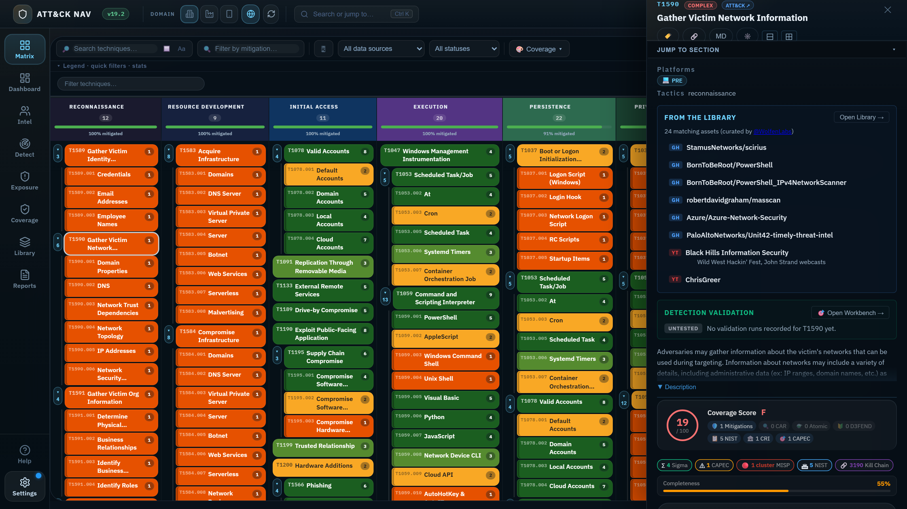
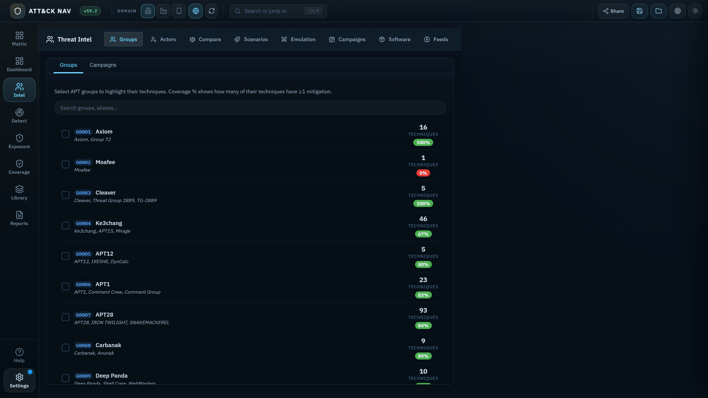

# ATTACK-Navi

ATTACK-Navi is a single-page Angular application for working with the MITRE ATT&CK matrix. It colors the matrix by mitigation, threat, vulnerability, detection and framework data, opens a detail sidebar for each technique, and puts longer tasks (threat group analysis, CVE exposure, detection content, control coverage, reporting) in routed workspaces with their own URLs.

It runs as a static site with no required backend. ATT&CK, D3FEND, CTID mappings and many other public datasets are fetched from their upstream sources in the browser; the app also ships bundled snapshots and some hand-curated content, and [Data sources](#data-sources) lists which is which. An optional proxy under `server/` can hold OpenCTI and MISP credentials.

A build is published to GitHub Pages at <https://teamstarwolf.github.io/ATTACK-Navi/> by the `deploy.yml` workflow. The site shows the last build that deployed successfully. The current release is v0.10.0, and release notes are in [CHANGELOG.md](CHANGELOG.md). Further documentation starts at [docs/README.md](docs/README.md).

## Screenshots

Captured on 2026-08-15 with `scripts/capture-screenshots.mjs`, in the dark theme. They predate the Status workspace, the grouped nav rail, and the toolbar rename from "ATT&CK NAV" to "ATT&CK Navi".





## Workspaces

The left rail groups the workspaces into three sections (Threat & Exposure, Response, Reference) and adds Settings and Help at the bottom. Items can be dragged to reorder them within a section, and the order is saved in the browser. A viewpoint selector at the top of the rail (Analyst, Red Team, Detection Engineering, Defense, Threat Intelligence, Vulnerability & Exposure, Governance & Executive, Deception) sets the default heatmap mode, navigates to that role's home workspace, and (for every viewpoint except Analyst) pins its preferred modes at the top of the heatmap picker. At 768px wide or less, the rail becomes a bottom bar and the sidebar and panels take the full width.

| Workspace | Route | Tabs |
| :-- | :-- | :-- |
| Matrix | `#/matrix` | None; the ATT&CK grid with the heatmap picker, filters and multi-select |
| Exposure | `#/exposure` | CVE, Risk, Kill Chain, Graph, Gap Analysis, Priority, SSVC, Dossier, What-If, CTEM |
| Intel | `#/intel` | Groups, Actors, Compare, Scenarios, Emulation, Campaigns, Software, Feeds |
| Detect | `#/detect` | Detections, Sigma, SIEM, YARA, Validation, Data Sources, Purple Team |
| Coverage | `#/coverage` | Assessment, Controls, Custom Mitigations, Compliance, Diff, Timeline, Target, Assets |
| Dashboard | `#/dashboard` | Overview, Analytics |
| Reports | `#/reports` | Report Builder, IR Playbooks, Export Hub |
| Library | `#/library` | Workbench, Layers, Collections, Comparison, Roadmap, Watchlist, Tags |
| Status | `#/status` | None; integration health, with coverage statistics and data-source status |
| Settings | `#/settings` | Preferences, Changelog |

Tabs have their own paths, for example `#/intel/groups` or `#/exposure/what-if`, so browser history and bookmarks work throughout.

A few tabs are easy to confuse. Intel > Scenarios simulates a chosen threat group's attack against your current coverage, while Exposure > What-If models the effect of changing coverage. Exposure > Risk plots techniques by threat exposure against security gap, in four quadrants. Intel > Feeds is the threat intelligence panel, with Intel Overview, Indicators, Threat Actors and MISP Events tabs; its per-technique score is the number of ATT&CK groups that use the technique, plus one if MISP Galaxy has a cluster for it.

## Matrix and technique sidebar

Selecting a technique opens the sidebar. A jump index at the top lists its sections by group: Technique, Threat Intel, Vulnerabilities, Compliance, Detections, Offense & Hunting, and Workspace (your tags, notes and custom mitigations). The completeness score in the sidebar adds weighted points for each kind of enrichment that is present and is capped at 100; the weights are in `src/app/components/sidebar/sidebar.component.ts`.

Other matrix behavior:

- Techniques that have sub-techniques show a chevron to expand them. Ctrl+E expands all of them.
- In multi-select mode, a bulk bar can add the selection to the watchlist, mark it implemented or planned, tag it, or clear it.
- The matrix menu can sort techniques by risk or alphabetically and dim techniques that have no coverage.
- A collapsible strip above the grid holds the legend and quick filters.
- Filter state (heatmap mode, mitigation and technique filters, platforms, groups, software, campaigns, data source, implementation status) is written to the URL query string, so the Share button and bookmarks reproduce a view. The Share link does not include the selected technique, but an incoming link with a `tech=` parameter, such as `#/matrix?tech=T1059`, selects it. Older share links in the `#tech=`, `#heat=` and `#import=` forms are rewritten when the app loads.
- New users get the light theme; the toolbar has a dark/light toggle and the choice is remembered.

The command palette (Ctrl+K) searches techniques, mitigations, groups, campaigns, software and CVEs, along with D3FEND, CAR, Atomic and Engage entries. It also has "Go to" commands for most workspace tabs and actions for the theme, clearing filters, copying a share link, keyboard help, CSV and XLSX export, Navigator layer export and opening the view in the MITRE ATT&CK Navigator.

## Heatmap modes

The heatmap picker reads `HEATMAP_MODES` in `src/app/models/heatmap-modes.ts`. The default mode is Unified Coverage. Groups appear in this order, below any modes the current viewpoint pins at the top:

| Group | Modes |
| :-- | :-- |
| Threat Landscape | Risk, Exposure, Software, Campaign, Intelligence, My Exposure |
| Vulnerabilities | KEV, CVE, EPSS, CVE Kill Chain, PoC Exploits |
| Detections | Detection, Sigma Rules, Elastic Rules, Splunk Detections, Wazuh XDR, M365 Defender, CAR, Atomic |
| Frameworks | D3FEND, Engage, NIST 800-53, VERIS Actions, CRI Profile, CSA CCM, M365 Controls, F3 Origin |
| Coverage & Posture | Mitigations, Status, Controls, Unified Coverage, Library Layer, Frequency |

The Library Layer mode colors the matrix by one of the Navigator layers listed in `src/assets/data/library-layers/index.json`, described in [docs/LIBRARY_LAYERS.md](docs/LIBRARY_LAYERS.md). Those layers are a separate list, not additional modes. Scoring for each mode is described in [docs/HEATMAPS.md](docs/HEATMAPS.md). Adding a mode touches several files; [AGENTS.md](AGENTS.md) has the checklist.

## Data sources

### ATT&CK and F3

The toolbar switches between four domains. Each has a live source and a bundled snapshot in `src/assets/data/`:

| Domain | Live source | Bundled snapshot |
| :-- | :-- | :-- |
| Enterprise ATT&CK | `mitre-attack/attack-stix-data` | v19.2 |
| ICS ATT&CK | `mitre-attack/attack-stix-data` | v18.1 |
| Mobile ATT&CK | `mitre-attack/attack-stix-data` | v18.1 |
| CTID F3 Fraud Framework | `center-for-threat-informed-defense/fight-fraud-framework` | v1.1 |

In the default live mode, the app uses a copy cached in IndexedDB if it is less than 24 hours old. Otherwise it renders the bundled snapshot first, fetches the live STIX bundle in the background and switches to it when it arrives. It reports an error only if both fail. A toolbar toggle switches to bundled-only mode. F3 has no mitigations or groups, so coverage views are empty for that domain.

The `refresh-data.yml` workflow runs monthly, regenerates the four snapshots and the CVE map described below, and opens a `data-refresh/YYYY-MM` pull request.

Many mapping datasets are pinned to older ATT&CK releases: most CTID Mappings Explorer files to ATT&CK 16.1, and CSA CCM to 17.1. Exposure > CVE and the CVE dossiers translate mapped technique IDs to the loaded release through ATT&CK's revoked-by relationships, and flag IDs that have no replacement instead of dropping them. The control mappings (NIST 800-53, AWS, Azure, GCP, CRI Profile, VERIS, CSA CCM and M365) are matched on the technique IDs as published and are not translated, so their mappings to retired techniques such as the T1562 family do not appear on the replacement techniques.

### Fetched at runtime

| Data | Upstream |
| :-- | :-- |
| CVE records | NVD CVE API 2.0 |
| Known exploited vulnerabilities, including known ransomware use | `cisagov/kev-data`, with the cisa.gov feed as fallback |
| Exploit probability | FIRST EPSS API (`api.first.org`) |
| Curated CVE to technique mappings | CTID `attack_to_cve` CSV and Mappings Explorer KEV mappings |
| CVE to technique inference, current and previous year | Galeax/CVE2CAPEC |
| Exploits and scan templates per technique | ExploitDB CSV on gitlab.com and `projectdiscovery/nuclei-templates`, matched to techniques through the CTID CVE mappings |
| Public proof-of-concept exploits | `trickest/cve` |
| CISA SSVC decision data | CVE Services (`cveawg.mitre.org`) |
| Sigma rule counts and rule detail | SigmaHQ Navigator coverage layer for counts; `mdecrevoisier/SIGMA-detection-rules` for per-technique rules |
| Elastic, Splunk and Microsoft 365 Defender counts | `elastic/detection-rules`, `splunk/security_content` and `microsoft/Microsoft-365-Defender-Hunting-Queries` |
| Atomic Red Team tests | Red Canary Navigator layer for counts, per-technique YAML on demand |
| CAR analytics | `mitre-attack/car` Navigator layer |
| Hunting queries, Sentinel rules and log samples | OTRF ThreatHunter-Playbook, `edoardogerosa/sentinel-attack`, `mdecrevoisier/EVTX-to-MITRE-Attack`, `Cyb3r-Monk/Threat-Hunting-and-Detection` |
| Control mappings | CTID Mappings Explorer: NIST 800-53 Rev5, AWS, Azure, GCP, CRI Profile v2.1 (Cyber Risk Institute), VERIS 1.4.0, CSA CCM 4.1, M365 controls |
| Defensive techniques | D3FEND API (`d3fend.mitre.org`) |
| Adversary engagement | MITRE Engage JSON (`mitre/engage`) |
| Attack patterns | CAPEC 2.1 STIX (`mitre/cti`) |
| MISP Galaxy ATT&CK clusters | `MISP/misp-galaxy` |
| ATT&CK release notes | `attack-stix-data` GitHub releases |
| Other sidebar content | `swisskyrepo/PayloadsAllTheThings`, `stamparm/ipsum`, `mukul975/Anthropic-Cybersecurity-Skills` |

Several of these are community repositories rather than vendor or MITRE datasets. The Elastic, Splunk and Microsoft 365 Defender counts come from GitHub tree listings and include only files whose path contains a technique ID, so they undercount. The Microsoft 365 Defender hunting query repository was archived by Microsoft in 2022.

### Bundled with the app

- The four STIX snapshots listed above.
- `cve-technique-map.json`, a CVE to technique index built by `scripts/build-cve-technique-map.mjs` from Galeax/CVE2CAPEC (CVE to CWE to CAPEC to ATT&CK) with a correction from `cwe-exploitation-anchor.json`. It stores exact per-technique counts and up to 200 sample CVE IDs per technique, and its `__meta` block records the source, generation date and totals. The UI keeps these inferred mappings separate from the curated CTID mappings.
- `cwe-catalog.json`, the CERT/CC SSVC decision tables in `ssvc-decision-tables.json`, and a set of pre-generated CVE dossiers in `dossiers/`.
- The Navigator layers in `library-layers/` and the curated SIEM queries in `src/assets/technique-queries.json`.
- `src/assets/library.json`, the index of tools, channels and X accounts behind Library > Workbench and the sidebar's From the Library section, generated in the companion library (see [Companion reference library](#companion-reference-library)).
- Offline fallbacks: a curated D3FEND countermeasure seed and a seed of CAR analytics checked against upstream. The live sources take precedence when they load.

### Curated content

Some content is written and maintained in this repository rather than derived from an upstream dataset: the Zeek, Suricata and YARA templates, Wazuh mappings, IR playbooks, offensive tools, C2, BloodHound, Azure identity, event logging, the IOC feed's technique associations, the PayloadsAllTheThings folder-to-technique mapping, and the SOC 2, ISO and PCI compliance mapper. Each of these services starts with a `PROVENANCE` comment. In the sidebar, the payloads, offensive tools, C2, BloodHound, Azure identity, logging, IOC feed, Wazuh XDR, SIEM and threat hunting sections carry a "curated" chip. IR playbooks, the Wazuh XDR heatmap mode and the Zeek, Suricata and YARA templates are not labeled as curated in the UI. [DATA_SOURCE_SCORECARD.md](DATA_SOURCE_SCORECARD.md) and [MAPPINGS_CHEAT_SHEET.md](MAPPINGS_CHEAT_SHEET.md) have more detail.

## Exports

Reports > Export Hub collects the coverage and workspace exports: coverage, tactic summary, implementation plan and full report CSVs; a multi-sheet Excel workbook; an HTML report; a PDF report, which opens in the browser print dialog; a print view and a PNG of the matrix; ATT&CK Navigator layer export, import and an "Open in Navigator" link; workspace state export and import as JSON; saved layers; and a full workspace backup.

Other exports live with the feature that produces them. Sigma, SIEM query, Suricata, Zeek and YARA output is in the Detect workspace, STIX 2.1 bundles are in Library > Collections, and MISP event templates are in Intel > Feeds.

## Getting started

You need Node.js ^22.22.3, ^24.15.0 or >=26.0.0 (the engine range of the locked Angular 22.2.1 packages), npm, and Chrome or Chromium for the unit tests.

```bash
git clone https://github.com/TeamStarWolf/ATTACK-Navi.git
cd ATTACK-Navi
npm ci
npm start
```

`npm start` runs `ng serve` with the development configuration at <http://localhost:4200>.

### Tests

```bash
npx ng test --watch=false --browsers=ChromeHeadless
npx playwright install chromium
npx playwright test
```

Unit specs use Karma and Jasmine and sit next to the code they test as `*.spec.ts` files under `src/`. Locally, the Playwright suite in `e2e/` starts `ng serve` on port 4200, or reuses one that is already running. `e2e/visual.spec.ts` compares screenshots against baselines captured on Windows; those tests are skipped when `CI` is set, and `npm run test:visual:update` regenerates the baselines. The proxy has its own tests: run `npm run proxy:install` once, then `npm test --prefix server`.

### Build

`npm run build` writes a production build to `dist/mitre-mitigation-navigator/browser/`. The directory name comes from the Angular project name in `angular.json`, which predates the current project name. The initial bundle budget warns at 1.2 MB and fails at 2 MB. `src/index.html` uses `<base href="./">`; pass `--base-href` when you host under a fixed path.

Production builds register the Angular service worker configured in `ngsw-config.json`. For data requests it tries the network first and falls back to a cached response when a request fails or takes longer than 10 seconds (15 seconds for the APIs). Cached responses are kept for 24 hours for the `mitre-attack` GitHub repositories, 12 hours for raw files from the CTID, Red Canary, SigmaHQ, Elastic, Splunk and MISP organizations and from `mitre/cti`, and 6 hours for the FIRST and NVD APIs. Requests to other hosts are not cached.

### npm scripts

| Script | Runs |
| :-- | :-- |
| `npm start` | `ng serve` |
| `npm run build` | `ng build` (production configuration) |
| `npm run watch` | `ng build --watch --configuration development` |
| `npm test` | `ng test` (Karma, watch mode) |
| `npm run e2e` | `playwright test` |
| `npm run test:visual` | `playwright test e2e/visual.spec.ts` |
| `npm run test:visual:update` | The visual tests with `--update-snapshots` |
| `npm run proxy:install` | `npm install --prefix server` |
| `npm run proxy:start` | `npm start --prefix server` |

## Configuration

The integrations are under Settings > Preferences > Integrations. None of them are required.

| Integration | Fields | What is stored |
| :-- | :-- | :-- |
| NVD API key | API key | sessionStorage only, so it lasts until the tab is closed |
| OpenCTI | URL and API token, or a proxy URL in proxy mode | URL, mode and proxy URL in localStorage; the token is kept in memory only |
| MISP | URL, API key and optional Org ID, or a proxy URL in proxy mode | URL, Org ID, mode and proxy URL in localStorage; the API key is kept in memory only |
| TAXII 2.1 servers, for importing STIX collections | Server URL, username and password (HTTP Basic) | Server list in localStorage, with passwords removed |

OpenCTI and MISP each have a Test & Save button. OpenCTI indicators are looked up per technique with a GraphQL query and appear in the sidebar and in Intel > Feeds. For MISP, the connection test works and the public MISP Galaxy data is shown, but the event and attribute queries are not yet connected to the UI (see [Known limitations](#known-limitations)).

The NVD key is sent only by the per-technique CWE lookups, which query at most five CWEs one after another, waiting 100 ms between requests with a key and 300 ms without. Keyword and CVE ID searches do not send it. NVD allows 50 requests per 30 seconds with a key and 5 without.

### Optional credentials proxy

The proxy keeps OpenCTI and MISP credentials on a server instead of in the browser.

```bash
npm run proxy:install
cp server/.env.example server/.env    # Windows cmd: copy server\.env.example server\.env
# Edit server/.env and set OPENCTI_URL, OPENCTI_TOKEN, MISP_URL, MISP_API_KEY and MISP_ORG_ID as needed
npm run proxy:start
```

Then set the OpenCTI or MISP mode in Settings to "Secure backend proxy" and enter the proxy URL, `http://localhost:8787` by default. If you set `PROXY_AUTH_TOKEN` in `server/.env`, paste the same value into Settings > Integrations > "Proxy access token"; the app sends it as `X-Proxy-Key` on every proxy request and keeps it in `sessionStorage` only, like the NVD key.

The proxy is a small Express app. It exposes `GET /api/health`, `POST /api/opencti/graphql`, and `GET` and `POST` under `/api/misp/` for a read-only allowlist (`servers/getVersion`, `attributes/restSearch`, `events/restSearch`, `events/view`). It binds `127.0.0.1` unless `HOST` says otherwise, and on a non-loopback `HOST` without `PROXY_AUTH_TOKEN` it fails closed: health still answers, every other route returns 503. Every credentialed route also checks the `Host` header against `localhost`, `127.0.0.1`, `::1` and `ALLOWED_HOSTS` (DNS-rebinding defence) and requires the `X-Requested-With` header the app sends, so a cross-origin browser call is always a CORS preflight that `ALLOWED_ORIGINS` decides. The code default origin is `http://localhost:4200` and `server/.env.example` lists only that; add your own deployment origin, never a shared one. The OpenCTI route parses each GraphQL document and forwards only read queries on the `about`, `indicators` and `threatActors` root fields (`OPENCTI_ALLOWED_QUERY_FIELDS` extends the list); mutations are refused unless `OPENCTI_ALLOW_IMPORT=true`, which admits exactly the app's `mutation ImportStix` used by Export to OpenCTI, and subscriptions are always refused. Upstream calls time out after `UPSTREAM_TIMEOUT_MS` (30 s) and bodies above `UPSTREAM_MAX_BYTES` (10 MB) or request bodies above `MAX_BODY_SIZE` (1 MB) are rejected.

## Deployment

### GitHub Pages

`.github/workflows/deploy.yml` runs on pushes to `main`, daily at 06:17 UTC, and on manual dispatch. It runs `npm ci`, the unit tests, and `ng build --base-href /ATTACK-Navi/`, then publishes `dist/mitre-mitigation-navigator/browser`. The Playwright suite runs separately in `e2e.yml` on pushes to `main` that change `src/`, `e2e/`, `playwright.config.ts` or `package.json`, and does not block the deploy.

No workflow runs the unit tests on pull requests. Pull requests get the Docker build and smoke test when they touch `src/`, the Dockerfile, `nginx.conf` or the package files, the proxy tests when `server/` changes, and OSV-Scanner and dependency review.

### Docker

```bash
cp server/.env.example server/.env
docker compose up --build
```

nginx serves the app at <http://localhost:8080>, and the proxy is published on 127.0.0.1:8787. Compose requires `server/.env` to exist even if you do not use the proxy. To run only the app, use `docker build -t attack-navi .` and `docker run -p 8080:80 attack-navi`.

The image is built on `node:24-alpine` with base href `/`. `nginx.conf` sets a Content-Security-Policy whose `connect-src` allows the site itself plus `raw.githubusercontent.com`, `api.github.com`, `gitlab.com`, `api.first.org`, `services.nvd.nist.gov` and `www.cisa.gov`. Requests to `d3fend.mitre.org`, `cveawg.mitre.org` and any MISP, OpenCTI, TAXII or proxy origin are blocked until you add them there. To use the proxy from the app on port 8080, add `http://localhost:8787` to `connect-src` and add `http://localhost:8080` to `ALLOWED_ORIGINS` in `server/.env`.

### Kubernetes

[docs/HELM.md](docs/HELM.md) describes the chart in `helm/attack-nav/`. Its default image, `ghcr.io/teamstarwolf/attack-nav:latest`, is not published by any workflow in this repository, so build and push your own image and set `image.repository` and `image.tag`. `values.yaml` also has a `proxy` block (off by default, with an equally unpublished `ghcr.io/teamstarwolf/attack-nav-proxy:latest` image), but no template reads it, so the chart deploys only the app even though docs/HELM.md describes a proxy sidecar.

## Architecture

The app uses standalone components only, and every component uses OnPush change detection. Routing uses `withHashLocation()`, so the app works on a static host that serves only `index.html`. Matrix and Status load as single components; the other eight workspaces lazy-load a route file, and `WorkspaceShellComponent` builds the tab bar from each child route's `data.tab`. The matrix route is detached rather than destroyed when you leave it, which keeps its scroll position, selection and expanded techniques.

`FilterService` holds filter and selection state in RxJS `BehaviorSubject`s, and `UrlStateService` writes that state to the query string inside the hash. `PanelNavService` maps older panel IDs (`app.routes-map.ts`) to routes. `DataService` loads the STIX bundles and parses them into the `Domain` model (`models/domain.ts`), including the revoked-by map (`supersededBy`) that the CVE panel and dossiers use to translate retired technique IDs. Each enrichment source has its own service.

The stack is Angular 22.2, TypeScript 6.0, RxJS 7.8 and zone.js 0.16, with `xlsx-js-style` for Excel export and `tinycolor2` for color handling. There is no UI component library or state-management library. Icons are inline SVGs adapted from Lucide (ISC license), registered in `shared/icons/icon-registry.ts`. [ARCHITECTURE.md](ARCHITECTURE.md) goes into more detail.

```text
src/app/
  app.config.ts        Router, HTTP client, title and route-reuse strategies
  app.routes.ts        Top-level routes
  app.routes-map.ts    Legacy panel IDs mapped to routes
  components/          Matrix, sidebar, toolbar, nav rail, command palette and feature panels
  layout/              WorkspaceShell (tab bar) and PageSection
  models/              Domain model, heatmap-modes.ts, shortcuts.ts, palette-commands.ts
  pages/               Workspace route files, matrix page and controls, Status, Export Hub, CTEM
  services/            Data loading, filter and URL state, hotkeys, one service per data source
  shared/icons/        Icon registry
  utils/               Legacy share-link shim and helpers
src/assets/data/       Bundled STIX snapshots, CVE map, CWE catalog, SSVC tables, dossiers, layers
e2e/                   Playwright tests
server/                Optional OpenCTI and MISP proxy
scripts/               Data build, screenshot and validation scripts
helm/attack-nav/       Helm chart
docs/                  Additional documentation
```

## Keyboard shortcuts

`src/app/models/shortcuts.ts` lists the shortcuts and drives the help overlay that `?` opens. `services/hotkeys.service.ts` implements the global keys, and the matrix component handles keys while the grid has focus. On macOS, Cmd works in place of Ctrl.

| Keys | Action |
| :-- | :-- |
| Ctrl+K | Open the command palette |
| Ctrl+Shift+F | Toggle the command palette |
| Ctrl+F | Focus the matrix technique search |
| Ctrl+E | Expand all sub-techniques |
| `?` | Show or hide the shortcut help |
| Esc | Close the palette or help; otherwise deselect the technique |
| `m` | Go to the Matrix |
| `d`, `t`, `w`, `r` | Toggle the Dashboard, Coverage Timeline, Watchlist or Exposure risk matrix; pressing the key again returns to the Matrix |
| `c` | Clear all filters |

Single-key shortcuts are ignored while you are typing in a field. When the matrix grid has focus, Tab moves between technique cells, the arrow keys move within and across tactic columns, Enter or Space opens the focused technique, `/` jumps to the technique search, and Esc clears the focused cell or leaves multi-select.

## Known limitations

- MISP event and attribute queries exist in `misp.service.ts` but nothing in the UI calls them. The MISP Events tab builds event templates locally.
- Control mappings (NIST 800-53, cloud, CRI Profile, VERIS, CSA CCM and M365) are not translated through revoked-by relationships, so mappings to retired techniques such as the T1562 family do not appear on the techniques that replaced them.
- CTID removed CIS Controls from Mappings Explorer as of ATT&CK v16, so the CIS Controls service has no source and loads empty.
- CONTRIBUTING.md, ARCHITECTURE.md, docs/CONFIGURATION.md, docs/HEATMAPS.md and docs/LIBRARY_LAYERS.md have not been updated for the Angular 22 upgrade and some recent additions. Where they disagree with `package.json` or the source, the code is correct.

## Companion reference library

[TeamStarWolf/TeamStarWolf](https://github.com/TeamStarWolf/TeamStarWolf) is a separate repository of written ATT&CK reference material from the same organization. The two are independent at runtime: this app loads ATT&CK, D3FEND and CTID mappings directly from their upstream sources in the browser and does not read the library's data files. What the app takes from the library is bundled at build time. Some of the Navigator layers in `src/assets/data/library-layers/` were authored there, and several cite library files such as `data/attack/technique_profiles.jsonl` as their source. `src/assets/technique-queries.json` mirrors the library's `detections/technique-queries.json`. `src/assets/library.json`, the index behind Library > Workbench and the sidebar's From the Library section, is generated by the library's `research/scripts/build_library_index.py`.

For the written background on a technique, group or detection, these are useful starting points:

| Reference | Contents |
| :-- | :-- |
| [ATT&CK Technique Atlas](https://github.com/TeamStarWolf/TeamStarWolf/blob/main/ATTACK_TECHNIQUE_ATLAS.md) and [technique pages](https://github.com/TeamStarWolf/TeamStarWolf/tree/main/techniques) | Enterprise techniques with mitigations, NIST controls, groups, software and detection notes, written against ATT&CK v18.1 |
| [Threat Group Profiles](https://github.com/TeamStarWolf/TeamStarWolf/blob/main/THREAT_GROUP_PROFILES.md), [Software Reference](https://github.com/TeamStarWolf/TeamStarWolf/blob/main/ATTACK_SOFTWARE_REFERENCE.md) and [Campaigns Reference](https://github.com/TeamStarWolf/TeamStarWolf/blob/main/ATTACK_CAMPAIGNS_REFERENCE.md) | ATT&CK groups, software and campaigns cross-referenced to techniques |
| [Technique Detection Library](https://github.com/TeamStarWolf/TeamStarWolf/blob/main/detections/TECHNIQUE_DETECTION_LIBRARY.md) | Detection queries for Splunk, Elastic, Microsoft Defender and Sentinel, Chronicle and CrowdStrike |
| [Threat-Informed Defense Reference](https://github.com/TeamStarWolf/TeamStarWolf/blob/main/THREAT_INFORMED_DEFENSE_REFERENCE.md) and [data/](https://github.com/TeamStarWolf/TeamStarWolf/tree/main/data) | The CVE, CWE, CAPEC, ATT&CK and D3FEND relationship model and the library's datasets |
| [ICS](https://github.com/TeamStarWolf/TeamStarWolf/blob/main/ICS_ATTACK_ATLAS.md) and [Mobile](https://github.com/TeamStarWolf/TeamStarWolf/blob/main/MOBILE_ATTACK_ATLAS.md) atlases | The same treatment for the ICS and Mobile domains, written against ATT&CK v18.1 |

## Documentation

| Document | Contents |
| :-- | :-- |
| [docs/README.md](docs/README.md) | Documentation index and suggested reading order |
| [docs/application-overview.md](docs/application-overview.md) | Overview of workflows, runtime model and current limits |
| [ARCHITECTURE.md](ARCHITECTURE.md) | Components, data flow and state management |
| [WORKFLOWS.md](WORKFLOWS.md) | Analyst workflows: behavior analysis, threat intelligence, vulnerability exposure, detection coverage, validation and testing, compliance mapping, coverage analysis, and reporting |
| [DATA_SOURCE_SCORECARD.md](DATA_SOURCE_SCORECARD.md) | Integration status for each data source |
| [MAPPINGS_CHEAT_SHEET.md](MAPPINGS_CHEAT_SHEET.md) | ATT&CK, CVE, CWE, CAPEC, CPE and D3FEND mapping systems |
| [docs/HEATMAPS.md](docs/HEATMAPS.md) | Heatmap modes and scoring |
| [docs/LIBRARY_LAYERS.md](docs/LIBRARY_LAYERS.md) | Library layer inventory and provenance |
| [docs/COMPONENTS.md](docs/COMPONENTS.md) and [docs/SERVICES.md](docs/SERVICES.md) | Notes on components and services |
| [docs/CONFIGURATION.md](docs/CONFIGURATION.md) | Settings and integration setup |
| [docs/HELM.md](docs/HELM.md) | Helm chart |
| [OPEN_SOURCE_INTEGRATIONS.md](OPEN_SOURCE_INTEGRATIONS.md) | Candidate open-source integrations |
| [AGENTS.md](AGENTS.md) | Conventions for coding agents, including the heatmap mode checklist |
| [ThreatDragonModels/ATTACK-Navi/ATTACK-Navi.json](ThreatDragonModels/ATTACK-Navi/ATTACK-Navi.json) | STRIDE threat model of the app and proxy, in OWASP Threat Dragon format |
| [CHANGELOG.md](CHANGELOG.md) | Release notes |

## Contributing and security

Contributions are welcome. [CONTRIBUTING.md](CONTRIBUTING.md) covers code conventions and how to add a service, a heatmap mode, a workspace tab or a sidebar section; its setup section is older than this README, so use the requirements in [Getting started](#getting-started). Please follow the [Code of Conduct](CODE_OF_CONDUCT.md).

Report vulnerabilities privately, as described in [SECURITY.md](SECURITY.md), rather than in a public issue.

## License

The application code in this repository is released under the [MIT License](LICENSE).

MITRE ATT&CK® is a registered trademark of The MITRE Corporation. This project is not affiliated with or endorsed by MITRE. Third-party data sources, APIs and upstream content remain subject to their own licenses and terms.
